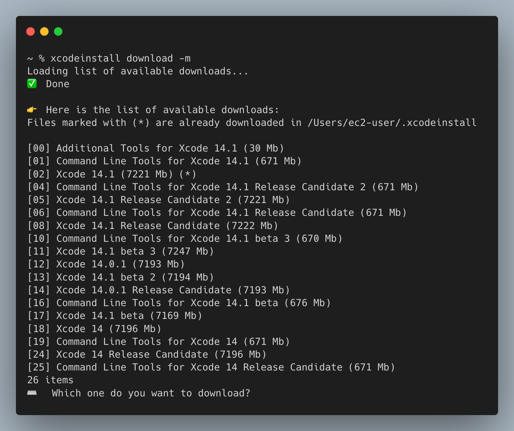

[](https://github.com/sebsto/xcodeinstall/actions/workflows/build_and_test.yml)

[](https://github.com/sebsto/xcodeinstall/actions/workflows/build_and_test_gh_hosted.yml)


[](LICENSE)

This is a command line utility to download and install Xcode in headless mode (from a Terminal only). No Apple ID is required to download Xcode.

## TL;DR




## What is it

`xcodeinstall` is a command line utility to download and install Xcode from the terminal only. It may work interactively or unattended. There is no need to authenticate on Apple Developer Portal to initiate an Xcode download. 

**No Apple Developer Account is required to download and install Xcode with this tool**

Let me repeat : downloads happen without user authentication on Apple Developer portal.

## Demo 


## Why install Xcode in headless mode?

When preparing a macOS machine in the cloud for CI/CD, you don't always have access to the login screen, or you don't want to access it.

It is a best practice to automate the preparation of your build environment to ensure they are always identical.

## How to install 

Most of you are not interest by the source code. To install the brinary, use [homebrew](https://brew.sh) package manager and install a custom tap, then install the package. 

First, install the custom tap. This is a one-time operation.

```zsh
➜  ~ brew tap sebsto/macos

==> Tapping sebsto/macos
Cloning into '/opt/homebrew/Library/Taps/sebsto/homebrew-macos'...
remote: Enumerating objects: 6, done.
remote: Counting objects: 100% (6/6), done.
remote: Compressing objects: 100% (5/5), done.
remote: Total 6 (delta 0), reused 0 (delta 0), pack-reused 0
Receiving objects: 100% (6/6), 5.55 KiB | 5.55 MiB/s, done.
Tapped 1 formula (13 files, 21.7KB).
```

Once the tap is added, install the package by typing `brew install xcodeinstall`

```zsh
➜  ~ brew install xcodeinstall 

==> Downloading https://github.com/sebsto/xcodeinstall/archive/refs/tags/v0.1.tar.gz
Already downloaded: /Users/stormacq/Library/Caches/Homebrew/downloads/03a2cadcdf453516415f70a35b054cdcfb33bd3a2578ab43f8b07850b49eb19c--xcodeinstall-0.1.tar.gz
==> Installing xcodeinstall from sebsto/macos
🍺  /opt/homebrew/Cellar/xcodeinstall/0.2: 8 files, 25.6MB, built in 2 seconds
==> Running `brew cleanup xcodeinstall`...
```

Once installed, it is in the path, you can just type `xcodeinstall` to start the tool.

## How to use 

### Overview 

```
➜  ~ xcodeinstall

OVERVIEW: A utility to download and install Xcode

USAGE: xcodeinstall [--verbose] <subcommand>

OPTIONS:
  -v, --verbose           Produce verbose output for debugging
  --version               Show the version.
  -h, --help              Show help information.

SUBCOMMANDS:
  list                    List available versions of Xcode and development tools
  download                Download the specified version of Xcode
  install                 Install a specific XCode version or addon package

  See 'xcodeinstall help <subcommand>' for detailed help.
```

### List files available to download 

```
➜  ~ xcodeinstall list -h
OVERVIEW: List available versions of Xcode and development tools

USAGE: xcodeinstall list [--verbose] [--force] [--only-xcode] [--xcode-version <xcode-version>] [--most-recent-first] [--date-published]

OPTIONS:
  -v, --verbose           Produce verbose output for debugging
  -x, --xcode-version <xcode-version>
                          Filter on provided Xcode version number (default: 14)
  -m, --most-recent-first Sort by most recent releases first
  -d, --date-published    Show publication date
  --version               Show the version.
  -h, --help              Show help information.
  ```

### Download file 

```
➜  ~ xcodeinstall download -h
OVERVIEW: Download the specified version of Xcode

USAGE: xcodeinstall download [--verbose] [--xcode-version <xcode-version>] [--most-recent-first] [--date-published] [--name <name>]

OPTIONS:
  -v, --verbose           Produce verbose output for debugging
  -x, --xcode-version <xcode-version>
                          Filter on provided Xcode version number (default: 14)
  -m, --most-recent-first Sort by most recent releases first
  -d, --date-published    Show publication date
  -n, --name <name>       The exact package name to downloads. When omited, it asks interactively
  --version               Show the version.
  -h, --help              Show help information.
  ```

  When you known the name of the file (for example `Xcode 13.4.1.xip`), you can use the `--name` option, otherwise it prompts your for the file name.

  ```
  xcodeinstall download --name "Xcode 13.4.1.xip"
  ```

### Install file 

This tool call `sudo` to install packages.  Be sure your userid has a a `sudoers` file configured to not prompt for a password.

```
➜  ~ cat /etc/sudoers.d/your_user_id 
# Give your_user_id sudo access
your_user_id ALL=(ALL) NOPASSWD:ALL
```

The alternative is to use `sudo` when you call `xcodeinstall install`

```
➜  ~ xcodeinstall install -h 
OVERVIEW: Install a specific XCode version or addon package

USAGE: xcodeinstall install [--verbose] [--name <name>]

OPTIONS:
  -v, --verbose           Produce verbose output for debugging
  -n, --name <name>       The exact package name to install. When omited, it asks interactively
  --version               Show the version.
  -h, --help              Show help information.
```

When you known the name of the file (for example `Xcode 13.4.1.xip`), you can use the `--name` option, otherwise it prompts your for the file name.

  ```
  xcodeinstall install --name "Xcode 13.4.1.xip"
  ```

## How to contribute 

I welcome all type of contributions, not only code : testing and creating bug report, documentation, tutorial etc...
If you are not sure how to get started or how to be useful, contact me at stormacq@amazon.com

I listed a couple of ideas below.

## List of ideas 

- add a CloudWatch Log backend to Logging framework 

## Credits 

[xcode-install](https://github.com/xcpretty/xcode-install) and [fastlane/spaceship](https://github.com/fastlane/fastlane/tree/master/spaceship) both deserve credit for figuring out the hard parts of what makes this possible.