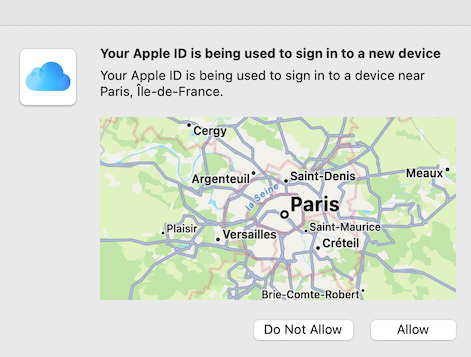
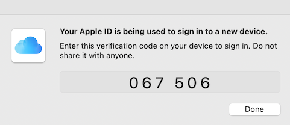

This is a command line utility to download and install Xcode in headless mode (from a Terminal only).

It works either interactively or unattended. In **interactive mode**, it prompts you for your Apple Developer account username, password and MFA code.  In **unattended mode**, it fetches your Apple Developer username and password from AWS Secrets Manager. (Instructions to configure this are below)

When **MFA is configured** (which we highly recommend), a human interraction is required to enter the MFA code sent to your device.  This step cannot be automated.

The username and password ARE NOT STORED on the local volumes. They are used to interract with Apple's Developer Portal API and collect a session token.  The session token is stored in `$HOME/.xcodeinstall` in *interactive mode* or on AWS Secrets Manager when using username and password are also stored on it.

The session stays valid for several days, sometimes weeks before it expires.  When the session expires, you have to authenticate again.

## Why install Xcode in headless mode?

When preparing a macOS machine in the cloud for CI/CD, you don't always have access to the login screen, or you don't want to access it.

It is a best practice to automate the preparation of your build environment to ensure they are always identical.

## How to install

`brew add cask`

`brew install xcodeinstall`

## How to use 

### Overview 

```
➜  ~ xcodeinstall

OVERVIEW: A utility to download and install Xcode

USAGE: xcodeinstall [--verbose] <subcommand>

OPTIONS:
  -v, --verbose           Produce verbose output for debugging
  --version               Show the version.
  -h, --help              Show help information.

SUBCOMMANDS:
  authenticate            Authenticate yourself against Apple Developer Portal
  signout                 Signout from Apple Developer Portal
  list                    List available versions of Xcode and development tools
  download                Download the specified version of Xcode
  install                 Install a specific XCode version or addon package

  See 'xcodeinstall help <subcommand>' for detailed help.
```

### Authentication 

TODO : add authentication with AWS Secrets Manager username and password 

```
➜  ~ xcodeinstall authenticate -h 

OVERVIEW: Authenticate yourself against Apple Developer Portal

USAGE: xcodeinstall authenticate [--verbose]

OPTIONS:
  -v, --verbose           Produce verbose output for debugging
  --version               Show the version.
  -h, --help              Show help information.
```

Interractive authentication 

```
➜  ~ xcodeinstall authenticate    

⚠️⚠️⚠️
This tool prompts you for your Apple ID username, password, and two factors authentication code.
These values are not stored anywhere. They are used to get an Apple session ID.

The Session ID is securely stored on your AWS Account, using AWS Secrets Manager.
The AWS Secrets Manager secret name is "xcodeinstall_session"

⌨️  Enter your Apple ID username: <your apple id email>
⌨️  Enter your Apple ID password: 
Authenticating...
🔐 Two factors authentication is enabled, enter your 2FA code: 000000
✅ Authenticated with MFA.
```

The above triggers the following prompt on your registered machines (laptop, phone, or tablet)





### List files available to download 

### Download file 

### Install file 

To install Xcode, run this tool from a user allowed to use `sudo` command.  On Amazon EC2, ``ec2-user` is part of the sudoers file. When running on your local machine, your normal admin account is also valid.

## How to store your secrets on AWS Secrets Manager

## How to contribute 